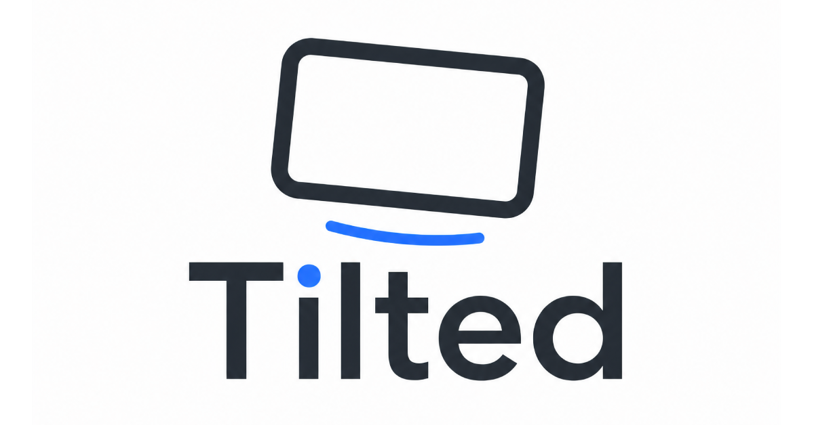

# Tilted



Tilted is a mobile-first, classroom-friendly team guessing game for browsers. One player
holds up a phone in landscape mode while teammates describe the visible word without saying
the word or any part of it. The phone holder guesses, then tilts the phone to mark the card
Correct or Pass. Always-available touch controls work as a fallback.

The built-in library includes more than 70 decks organized into browseable categories such
as Education, Animals, Disney, Theme Parks, Movies & TV, Music, Heroes & Sci-Fi, Sports &
Games, Places & Travel, Food & Everyday, and Just for Fun. Every built-in deck includes at
least 50 shuffled cards.

## Run locally

```bash
npm install
npm run dev
```

Open the URL printed by Vite. For checks and a production build:

```bash
npm run typecheck
npm test
npm run build
```

## Motion controls

Tilted uses browser `DeviceOrientationEvent` data when available. Motion controls are
optional: the large Correct and Pass buttons and keyboard shortcuts work without sensor data.
During an active motion round, the buttons stay hidden so the card fills the screen. Tap the
top-right menu button to reveal the fallback controls or pause the round. A paused round can
be resumed or quit. Correct and Pass actions use distinct screen flashes, short sound cues,
and vibration patterns when the browser and device support them.

Motion access normally requires HTTPS outside of local development. iOS Safari also requires
the permission request to happen directly after a user taps a button. That is why Tilted
requests access after **Start Round** is tapped instead of asking on page load.

After permission is granted, move the phone to your forehead. Tilted notices the larger
movement, shows **Ready?**, and silently calibrates while counting down from three. During the
round, make a deliberate tilt down for Correct or up to Pass. The directions can be reversed
in round setup. Return the phone to its starting position between cards so one movement does
not score multiple cards.

Browsers do not expose whether the phone's system rotation-lock toggle is enabled. Tilted
can detect that the viewport is still portrait and remind the player to disable Portrait
Orientation Lock on iPhone or enable Auto-rotate on Android before the round starts.

### Troubleshooting tilt

- Use the Correct and Pass buttons if a browser reports that motion is unavailable.
- Serve the production build over HTTPS when testing on a phone.
- On iOS Safari, reload the page and tap **Start Round** again if no prompt appears.
- Check browser or device privacy settings if permission was denied.
- Try reversing the tilt directions if the device orientation feels opposite to expectations.
- Hold the phone against your forehead and steady during the three-second countdown.

## Keyboard controls

- `Right Arrow`: Correct
- `Left Arrow`: Pass
- `Space`: Pause or resume

## Custom decks

Use **Create/Edit Decks** to make decks stored in browser LocalStorage. Built-in decks are
read-only, but each can be copied into an editable custom deck. Prompts can be pasted one per
line. Each prompt is the target word teammates describe; custom decks can include a category
and custom cards can include an optional hint. Full decks can be exported and imported as JSON.

## Deploy

Run `npm run build` and publish the generated `dist/` directory. Vite uses relative asset URLs,
so the build can be hosted on GitHub Pages, Netlify, Vercel, or another static host. Use an
HTTPS URL if you want motion controls on mobile devices.

## Docker

Tilted also ships as a multi-stage Docker image. The final container serves the static
bundle from an unprivileged Nginx process on port `8080`.

Build and run it locally:

```bash
docker compose up --build -d
curl http://127.0.0.1:8080/healthz
```

Open `http://127.0.0.1:8080`. Stop the local container with:

```bash
docker compose down
```

The container is stateless. Custom decks stay in the browser's LocalStorage, so rebuilding or
updating the image does not remove a user's decks on that same browser and site URL.

## Publish to GHCR

The GitHub Actions workflow in `.github/workflows/publish-container.yml` publishes multi-platform
images to GitHub Container Registry after a push to `main`, a `v*` tag, or a manual workflow run.
Replace `<github-owner>` with the GitHub account or organization that owns your repository:

```text
ghcr.io/<github-owner>/tilted:latest
```

The workflow also publishes the branch name, Git tag, and commit SHA as image tags. Its image
path follows the GitHub repository automatically. To run the published image with Compose
instead of building locally:

```bash
TILTED_IMAGE=ghcr.io/<github-owner>/tilted:latest docker compose up -d
```

## Run on Unraid

Create a new Docker container in Unraid with these values:

| Setting | Value |
| --- | --- |
| Repository | `ghcr.io/<github-owner>/tilted:latest` |
| Container port | `8080` |
| Host port | Any available port, such as `8080` |
| Network type | Your usual reverse-proxy-compatible network |
| Restart policy | `unless-stopped` |

Point the reverse proxy upstream to `http://<unraid-ip>:8080` or the container name and port if
the proxy shares its Docker network. Terminate TLS at the reverse proxy and use an HTTPS public
URL. HTTPS is required for mobile motion permissions outside local development.

If the GHCR package is private, configure Unraid with a GitHub username and a personal access
token that can read packages before pulling the image. Publishing the package publicly avoids
that extra registry-login step.
